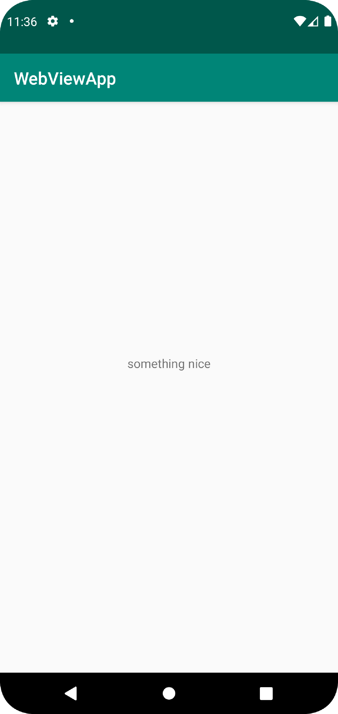

# Rapport
Skrev en ny string resurs som heter "hello_message" och har värdet "something nice".
```
<resources>
    <string name="app_name">WebViewApp</string>
    <string name="action_external_web">External Web Page</string>
    <string name="action_internal_web">Internal Web Page</string>
    <string name="hello_message">something nice</string>
</resources>
```
Satte text till resursen "hello_message".
```
    <TextView
        android:layout_width="wrap_content"
        android:layout_height="wrap_content"
        android:text="@string/hello_message"
        app:layout_constraintBottom_toBottomOf="parent"
        app:layout_constraintLeft_toLeftOf="parent"
        app:layout_constraintRight_toRightOf="parent"
        app:layout_constraintTop_toTopOf="parent" />
```
Screenshot av appen
